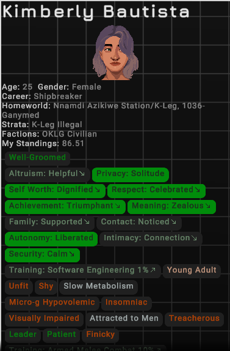
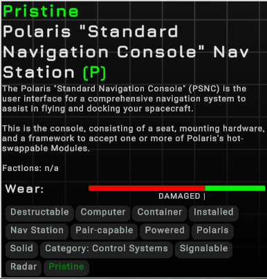
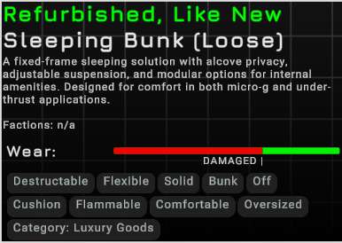

# PristineMegaTooltip

Ostranauts mod that simplifies the mega tooltip by removing clutter and displaying item condition labels.

---

## Features

* Removes item image from the mega tooltip
* Restored value (`$`) display
* Expands the mega tooltip by default
* Displays condition labels (Pristine, Refurbished, Like New, Worn, Used)
* Reduces font size for improved layout readability
* 
* 
* 

Tested on Ostranauts 0.15.0.30 (64).

---

## Requirements

* [BepInExPack_Ostranauts](https://new.thunderstore.io/c/ostranauts/p/BepInEx/BepInExPack_Ostranauts)

---

## Installation

1. Install BepInEx into your Ostranauts directory
2. Place `PristineMegaTooltip.dll` into:

   ```
   Ostranauts/BepInEx/plugins/
   ```
3. Launch the game

---

## Compatibility

* Works alongside **PristineMouseover**
* May conflict with other tooltip/UI mods

---

## Related Mod

**[Pristine Mouseover](https://github.com/Behmused/PristineMouseover)**

* Adds `(P)` to item mouseover tooltip if item is Pristine

---

## License

MIT
